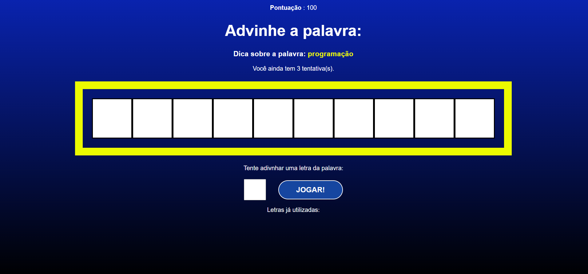

# Jogo da Palavra Secreta



## Descrição
Este é um jogo da palavra secreta para testar a capacidade cognitiva. O objetivo do jogo é adivinhar uma palavra secreta, chutando letras uma a uma. A cada tentativa, as letras corretas são reveladas e as incorretas são marcadas.

## Tecnologias Utilizadas
- Javascript
- React.js

## Como executar o projeto

### Clone o repositório:

```bash
git clone https://github.com/beamatias/Secret-Word.git
```
### Instale as dependências:

```Bash
cd secret-word
```

```Bash
npm install
```

### Inicie o servidor de desenvolvimento:
```Bash
npm start
```

### Acesse o jogo online:

[Acesse aqui](https://secret-word-sigma-five.vercel.app/)
